# Phase 1: Proxmox Installation & Set Up

## Table of Contents
1. [Objectives](#objectives)
2. [Configuring Motherboard](#1-configuring-motherboard)
3. [Installing Proxmox](#2-installing-proxmox)
    - [3.1 What is Proxmox](#31-what-is-proxmox)
    - [3.2 Configure Bootable USB Stick](#32-configure-bootable-usb-stick)
    - [3.3 Booting Proxmox VE](#33-booting-proxmox-ve)
4. [Setting Up Proxmox Environment](#4-setting-up-proxmox-environment)

## 1. Objectives
- [ ] Configure BIOS to optimum settings
- [ ] Install Promox 
- [ ] Set up environment for future production use 
- [ ] Mount used hard drives while retaining previously written data

## 2. Configuring Motherboard

Converting the PC into a 24/7 available server requires its settings to be built for it. The following has been done to ensure that the BIOS settings has been optimised to prevent future headaches:

| Category | Setting Name | Target Value | Location (MSI BIOS) | Why? |
| :--- | :--- | :--- | :--- | :--- |
| **CPU** | **SVM Mode** | **Enabled** | Overclocking \> CPU Features | **Critical.** Enables AMD hardware virtualization for K3s, Docker, and VMs. |
| **CPU** | **PSS Support** | **Enabled** | Overclocking \> CPU Features | Allows the CPU to downclock when idle to save power and reduce heat. |
| **Power** | **Global C-state Control** | **Enabled** | Overclocking \> CPU Features | Essential for power saving; lets the CPU enter deep sleep states. |
| **Power** | **Restore on AC Power Loss** | **Power On** | Settings \> Advanced \> Power Mgmt | Ensures the server reboots automatically after a power outage. |
| **Boot** | **Fast Boot** | **Disabled** | Settings \> Boot | Prevents skipping USB initialization; necessary for troubleshooting/recovery. |
| **Boot** | **Boot Mode Select** | **UEFI** | Settings \> Boot | The modern standard for Linux distros and large storage volumes. |
| **Memory** | **A-XMP** | **Profile 1** | Main OC Page | Ensures the RAM runs at the rated 3000 MHz instead of the 2133 MHz default. |
| **Security** | **Secure Boot** | **Disabled** | Settings \> Security | Prevents "unsigned" kernel issues when installing specific Linux distros. |
| **Advanced** | **Above 4G Decoding** | **Enabled** | Settings \> Advanced \> PCIe | Optimizes GPU memory addressing for future AI or Transcoding tasks. |

## 3. Installing Proxmox

### 3.1 What is Proxmox

Proxmox is a control center for your computer that lets you run multiple "virtual" computers (like Windows, Linux, or MacOS) all at the same time on a single piece of hardware.

Proxmox is an open-source enterprise virtualization platform based on Debian that integrates a KVM hypervisor and LXC containers with built-in web-based management for networking, storage, and high-availability clustering.

### 3.2 Configure Bootable USB Stick

**1. Download Proxmox VE ISO Image in preferred folder**
```powershell
Invoke-WebRequest -Uri "https://enterprise.proxmox.com/iso/proxmox-ve_9.1-1.iso" -OutFile "proxmox-ve_9.1-1.iso"
```

**2. Download rufus software.**


Rufus a utility that helps format and create bootable USB flash drives, such as USB keys/pendrives, memory sticks, etc.
```powershell
Invoke-WebRequest -Uri "https://github.com/pbatard/rufus/releases/download/v4.12/rufus-4.12.exe" -OutFile "rufus-4.12.exe"
```

**3. Flash the ISO to USB**

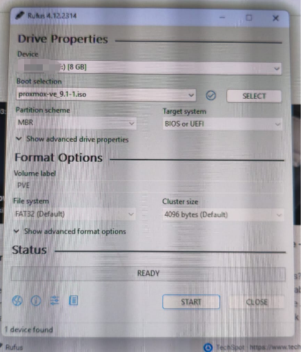

> [!IMPORTANT] 
>"Write in DD Image mode" is automatically selected. Proxmox uses a specific file structure that often fails to boot if written in standard ISO mode. 

### 3.3 Booting Proxmox VE

For a more detailed installation guide, please refer to the official installation guide [LINK](https://www.proxmox.com/en/products/proxmox-virtual-environment/get-started)

**1. Enter BIOS** 

This can be achieved via repeatedly pressing "F2", "F9", "DEL" key depending on the motherboard of the system.

**2. Boot from USB Stick** 

For MSI motherboards, navigate via "Advanced (F7)" > "SETTINGS" > "Save and Exit". Under "Boot Override", select the USB name and click "enter".

**3. Click on "Install Proxmox VE (Graphical)**

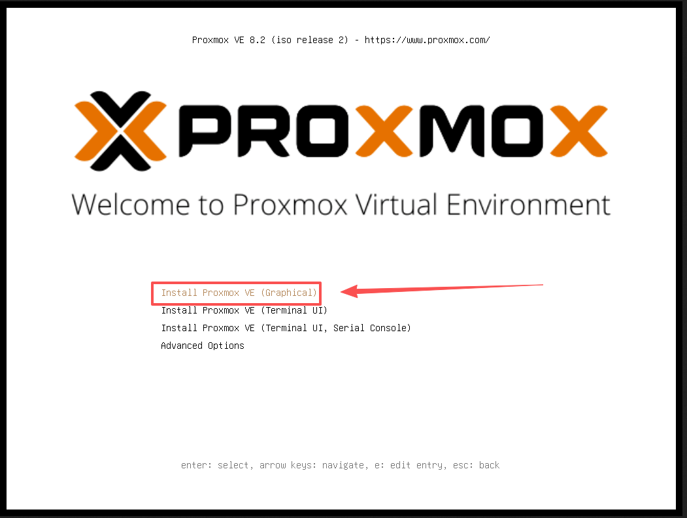

**4. Select drive for OS formatting**

This instructs where the OS files and folders should be created in, preferably on a SSD. Other hard drives can be formatted and passed through later.

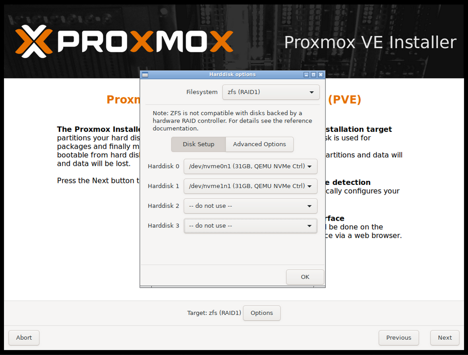


**5. Enter password and email address** 

Password will be "root" user password. Email will be used to receive notifications regarding the Proxmox server. 

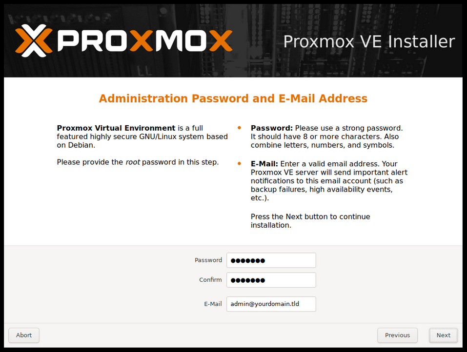

**6. Enter Server IP address** 

IP address assigned here is the server's static IP addres. Enter other information such as netmask, gateway and DNS server. 

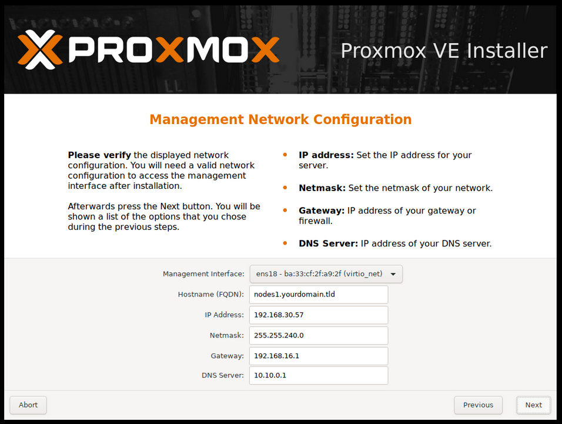

> [!NOTE] 
> "Default Gateway", "DNS Server" and "Netmask" can be found via entering "ipconfig /all" in command prompt

**7. Review the summary, then click "Install"** When confirmed, click on submit. An IP address will be displayed later to interact with the server via a web GUI.

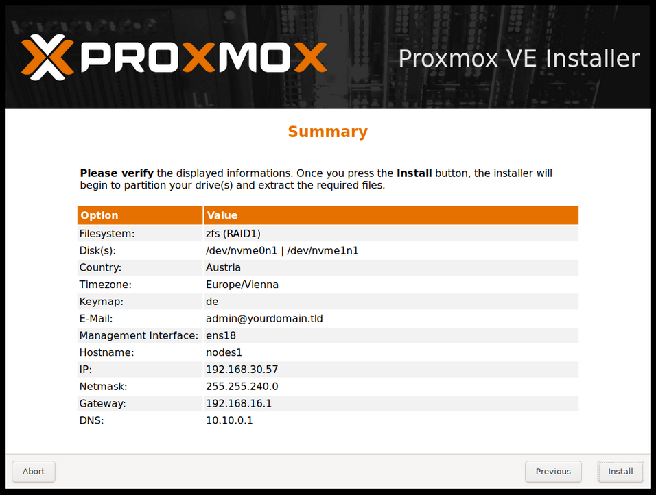

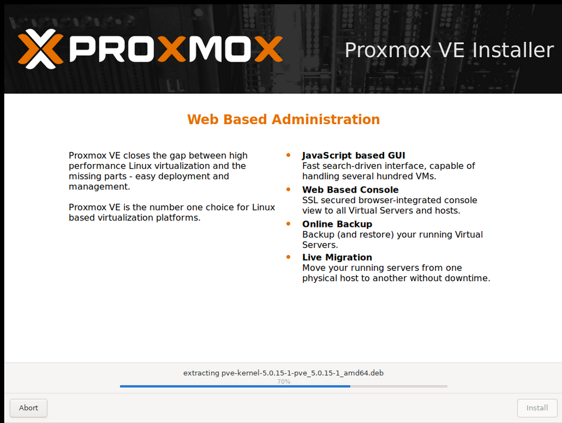


**8. Verifiy Installation is successful**

The screen should flash the terminal with a screenshot similar to the image below. Verify by other visiting the link provided, or logging in via the root user. 

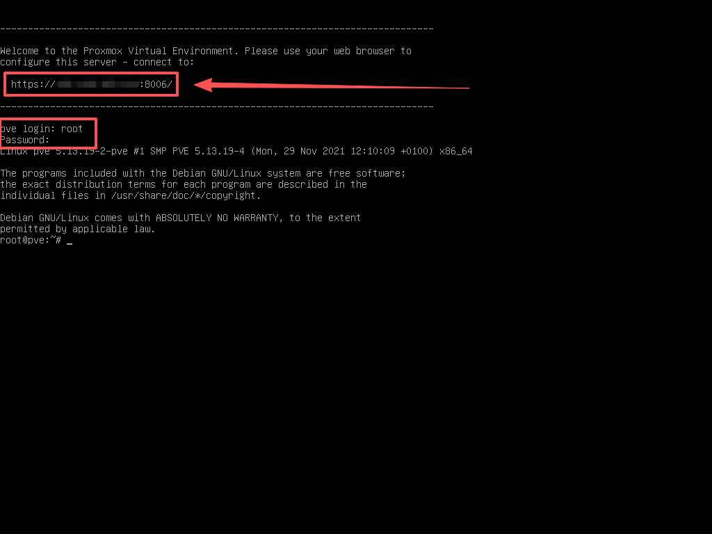

## 4. Setting up Proxmox Environment


### 4.1 Updating Repositories

**1. Navigate to Repositories**

Navigate to your node and click on "Subscriptions". Next, click on "Add"

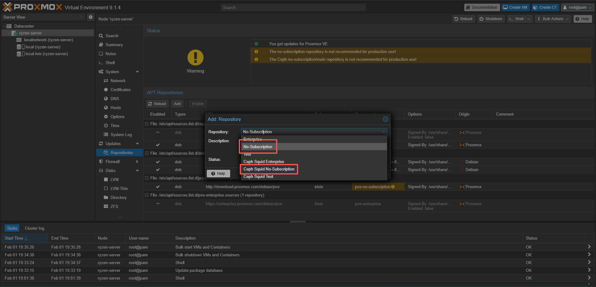


**2. Select on No-Subscription Repositories**

Repeat this step twice to select the two repositories highlighted in the screenshot below.


> [!NOTE]
> Remember to disable enterprise repositories by selecting on them and clicking 'Disable'

**3. Update and Upgrade Repos**

Reboot the server to refresh and enforce the changes.


**4. Update and Upgrade Repos**

After the server has rebooted, run the following command to update the repositories.

```bash
apt update && apt upgrade -y
```


### 4.2 Remove the Repository Subscription Notice

Proxmox will show a “No valid subscription” popup on login. To remove it:

**1. Edit the JavaScript file responsible for the popup:**

```bash
nano /usr/share/javascript/proxmox-widget-toolkit/proxmoxlib.js
```

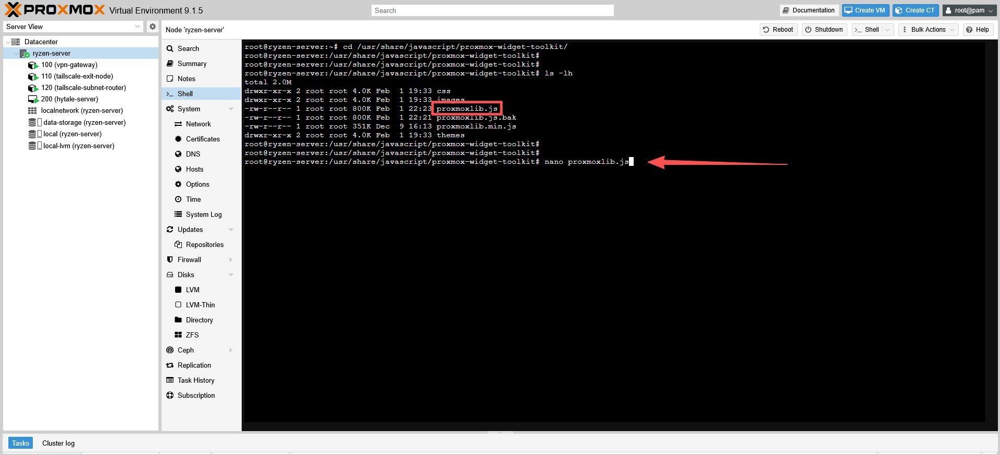

**2. Edit the Script**

Search for the phrase `No valid`. Edit the script 3 lines above to follow the following

```bash
res.data.status.toLowerCase() === 'active'
```

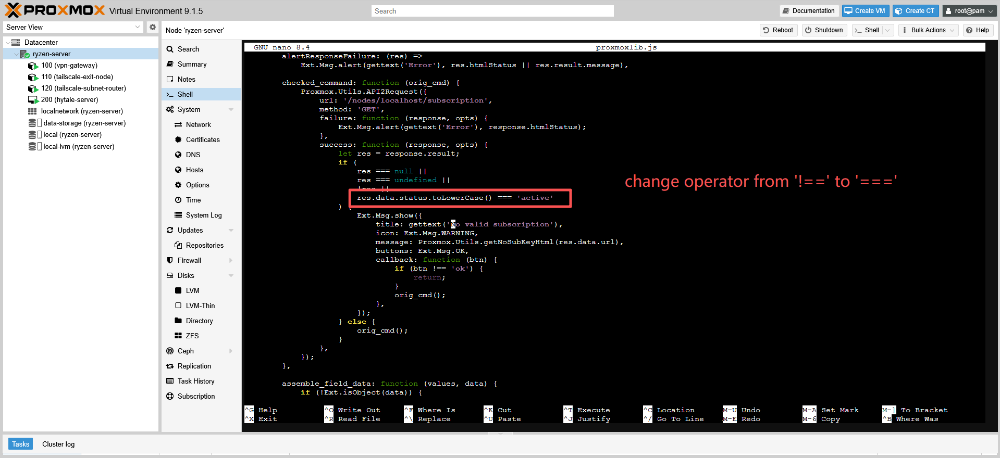

**3. Reboot server**

```bash
service pveproxy restart
```

---
[⬅ Back to Main README](../README.md)